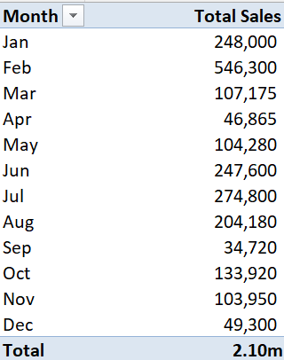

# Sales Report Analysis

## Introduction
In today’s highly competitive business environment, understanding sales performance is crucial for driving growth and achieving strategic objectives. This sales report analysis provides a comprehensive assessment of the sales performance of 2023 & 2024 and also identifies trends, opportunities, and challenges that have emerged during this period.

## Objectives
- Analyze sales data to identify trends.
- Calculate key performance metrics. 
- Visualize sales performance across various dimensions (e.g product category, region) in order to inform business strategies and decision making.

## Tools Used

### Excel
 - Data Cleaning and Calculations
 - Creating pivot tables for trend analysis.

### SQL
- Writing queries to extract and manipulate data.

### Power BI
- Visualizing data and generating interactive dashboards.

-------

## Data Cleaning with Excel and Excel formulas used                 

**Steps:**

- Removing Duplicates: Used the “Remove Duplicates” feature to clean the dataset to ensure accuracy.

- Data Formating: Ensured consistent date formats were used. MM/DD/YYYY for consistency in analysis.
  
**Formulas Used:**

- SUM
- AVERAGEIF
- SUMIF

**Calculations in Excel:**

**1. Total Sales Calculations:**
- Calculated revenue using (Quantity * UnitPrice) and used the fastfill method to fill all the way down
- Calculated total sales(Revenue) using the formula
  
                   =SUM(H2:H9922)
 which resulted in a total revenue of **2,101,090**

 ------

 **2. Average Sales per Product:**

- Calculated the average sale per product using
  
                  =AVERAGEIF(C2:C9922, "Shirt", H2:H9922)
 yielding an average of:
 
  **Shirt** 326.56, **Shoe** 308.70,  **Hat** 158.81, **Socks** 121.82, **Jacket** 139.94, **Gloves** 200.07.

  ----------

**3.Total Revenue by Region:**

- Calculated total revenue for each region using
  
                  =SUMIF(D2:D9922, "North", H2:H9922) 
and the fast fill method to fill down which resulted to the totals for;

**North** = 387,000, **South** = 927,820, **West** = 300,345, **East** = 485,925

-------
 
### Pivot Tables in Excel

- Created a pivot table to analyze sales by region, products and month, providing insights into performance from year **2023** and year **2024** respectfully.
  
  **Visuals:**
  - This table shows the Total sales generated from each product where **Shoes** has the highest sales **613,380**.
  
    
  - Table 2 showing the sales generated by each region using pivot table. **South** has the highest revenue of **927,820**.
 
    
  - Table 3 shows the total sales generated by months for year 2023 and 2024. **Febuary** has the highest sales of **546,300** generated from both years.

    

------

## SQL Sales Performance Report
The goal of this report is to show the sales performance based on their sales figures. The report will include:

- Highest selling product by sales value.
- Identify product with no sales in the last quarter usint the **left join function**.
- Total sales for each product.
- Number of sales transaction in each region.
- Total revenue per product.
- Percentage of total sales contributed by each region using the **case when statement** and **join function** 
  function.
- Monthly sales total for the current year.

**Data type structure**: Records individual sales transactions.

- Orderid: INT
- Customer_id: INT 
- Product: Varchar(50) 
- Region: Varchar(50)
- OrderDate: DATETIME
- Quantity: INT
- UnitPrice: Decimal
- Revenue: Numeric

## SQL Queries

 **1. This query retrieves total sales for each product.**

 ```sql
                         SELECT Product,
                         SUM(Total_Revenue) AS TotalSales
                         FROM SalesData
                         GROUP BY Region
                         ORDER BY Region
```


**2. Retrieving number of sales transaction in each region.**

 ```sql
                         SELECT Region, COUNT(*) AS NumberofSales
                         FROM SalesData 
                         GROUP BY Region
                         ORDER BY Region
```

**3. This query retrieves the highest selling products by total sales value.**

```sql

                        SELECT TOP (1) Product,
                        SUM(Quantity * UnitPrice) AS TotalSales
                        FROM SalesData
                        GROUP BY Product
                        ORDER BY TotalSales DESC;
```

**4. Retrieving total revenue per product.**

```sql
                        SELECT Product,
                        SUM(Quantity * UnitPrice) AS TotalRevenue
                        FROM SalesData
                        GROUP BY Product
                        ORDER BY Product
```

**5. This query retrieved the percentage of total sales contributed by each region.**

```sql

                         WITH TotalSales AS (
                         SELECT SUM(Quantity * UnitPrice) AS TotalSales
                        FROM [dbo].[SalesData]
                        ),
                         RegionSales AS (
                        SELECT 
                         Region,
                        SUM(Quantity * UnitPrice) AS RegionTotalSales
                        FROM [dbo].[SalesData]
                        GROUP BY Region
                        )
                        SELECT 
                         R.Region,
                        CASE
                        WHEN T.TotalSales = 0 THEN 0
                        ELSE (CAST(R.RegionTotalSales AS DECIMAL) / CAST(T.TotalSales AS FLOAT) * 100) 
                           END AS PercentageOfTotalSales
                        FROM
                        RegionSales R
                        CROSS JOIN
                        TotalSales T
                        ORDER BY R.RegionTotalSales DESC;
```

**6. This query retrieves the monthly sales for the current year.**

```sql

                        SELECT
                         MONTH(OrderDate) AS SalesMonth,
                        SUM(Quantity * UnitPrice) AS MonthlySalesTotal
                        FROM [dbo].[SalesData]
                        WHERE
                         YEAR(2024) = YEAR(2024)
                        GROUP BY (ORDERDATE)
                        ORDER BY
                        MONTH(OrderDate)
```

**7. This query identifies product with no sales in the last quarter.**

```sql

                         WITH LastQuarter AS (
                          SELECT
                          DISTINCT Product
                         FROM [dbo].[SalesData]
                          WHERE 
                         OrderDate >= DATEADD(QUARTER, -1, GETDATE())
                         )
                        SELECT P.Product
                         FROM
                        (SELECT DISTINCT Product 
                        FROM [dbo].[SalesData]) p
                        LEFT JOIN
                        LastQuarter LQ ON P.Product = LQ.Product
                         WHERE 
                        LQ.Product IS NULL;
```

-----

## Data Visualization with Power BI

This report provides insights into sales trends, products performance and behavior using interactive visuals.

**Key features**
- This Reports creates interactive dashboards to visualize sales performance metrics.

- Charts, Graphs, Tables and Slicers are used. Included bar charts to showcase region and  product trends, donut charts for average sales by product category and slicers to show sales performance for each year.

### Power BI Dashboard
**


